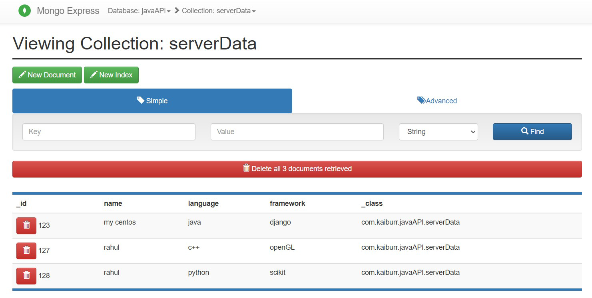
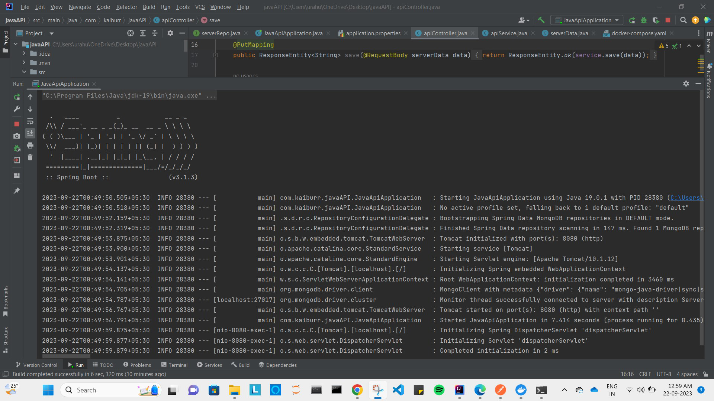
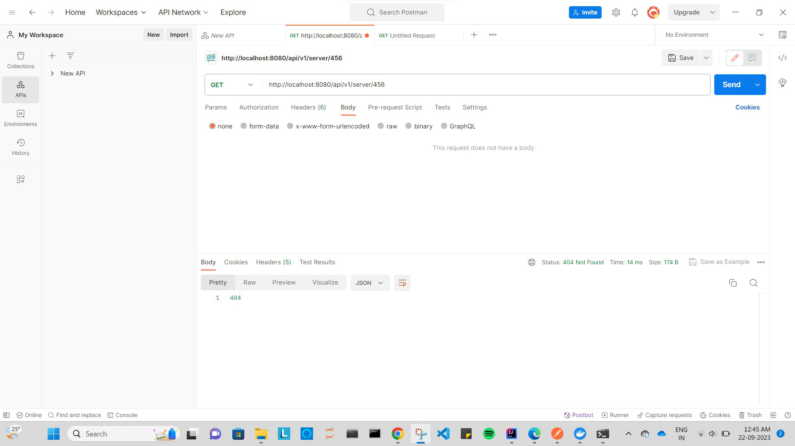
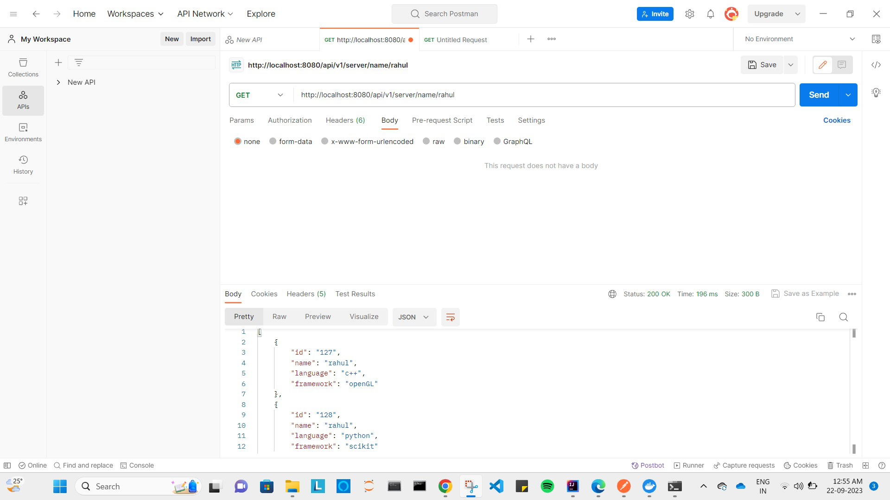
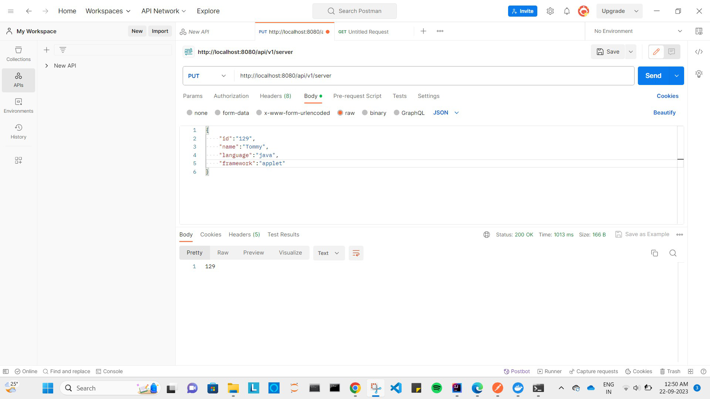
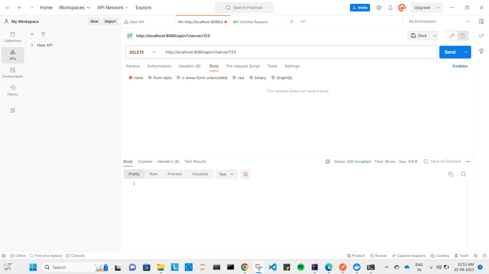

# Task 1. Java REST API example.
    A Rest API implemented using java. I have use docker contaier for mongoDB. Spring boot as a backend.
## Screenshot

## Tech Stack
    JAVA
    Spring Boot
    MongoDB
    Docker

